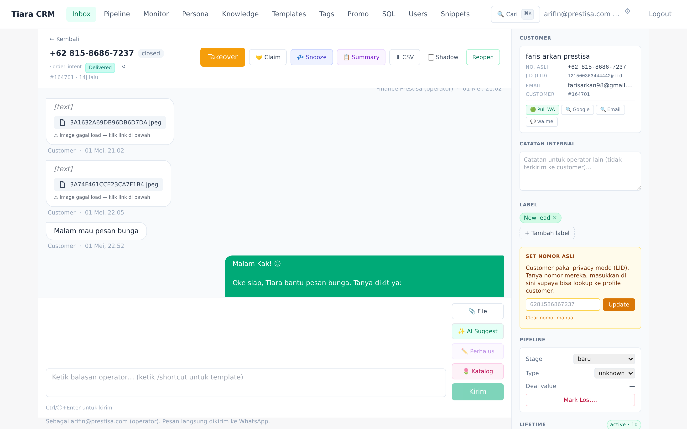
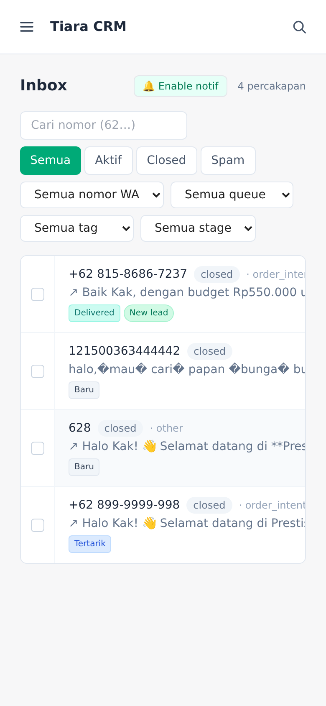
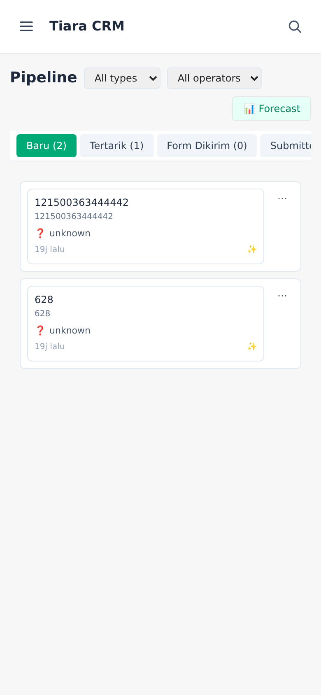

# Tiara CRM — Manual Operator

> **Untuk siapa:** operator/admin Prestisa yang menggunakan Tiara CRM setiap hari.
> **Tujuan:** memandu cara memakai semua fitur yang ada — inbox, pipeline, AI agent, knowledge base, dan tools tim — dari basic sampai advanced.

URL aplikasi: **https://salesai.prestisa.net**

---

## Daftar Isi

1. [Login & Navigasi Dasar](#1-login--navigasi-dasar)
2. [Inbox — Membalas Chat Customer](#2-inbox--membalas-chat-customer)
3. [Chat Detail — Tools Lengkap saat Membalas](#3-chat-detail--tools-lengkap-saat-membalas)
4. [Sales Pipeline — Tracking Deal](#4-sales-pipeline--tracking-deal)
5. [AI Monitor — Lihat Performa AI & Tim](#5-ai-monitor--lihat-performa-ai--tim)
6. [Persona & Settings AI](#6-persona--settings-ai)
7. [Knowledge Base](#7-knowledge-base)
8. [Reply Templates & Snippets](#8-reply-templates--snippets)
9. [Tags](#9-tags)
10. [Promo Settings](#10-promo-settings)
11. [User Management](#11-user-management)
12. [Mobile View](#12-mobile-view)
13. [FAQ Operator](#13-faq-operator)

---

## 1. Login & Navigasi Dasar

Buka https://salesai.prestisa.net → masukkan username + password yang diberikan admin → klik **Login**.

Setelah login, navbar atas berisi 10 menu utama:

| Menu | Fungsi |
|---|---|
| **Inbox** | Daftar percakapan WhatsApp customer (default landing page) |
| **Pipeline** | Kanban board untuk tracking deal stage |
| **Monitor** | Dashboard performa AI, operator, conversion |
| **Persona** | Setting AI Tiara + global toggle |
| **Knowledge** | KB topics yang AI bisa kutip |
| **Templates** | Reply template global (semua operator) |
| **Tags** | Master tag untuk klasifikasi conversation |
| **Promo** | Setting promo aktif yang AI bisa sebut |
| **SQL** | Query SQL aman untuk owner (read-only) |
| **Users** | Manage akun operator (admin only) |
| **Snippets** | Snippet pribadi operator |

Pojok kanan atas: tombol search (`⌘K`), email user yang login, ikon settings (⚙), tombol Logout.

---

## 2. Inbox — Membalas Chat Customer

Halaman default setelah login. Menampilkan list percakapan terbaru.

### 2.1 Filter (toolbar atas)

- **Cari nomor** — search by phone (mis. `628158...`)
- **Tab status** — Semua / Aktif / Closed / Spam
- **Semua nomor WA** — filter by WAHA session (kalau ada lebih dari 1)
- **Semua queue** — Semua / Queue saya (yang di-assign ke saya) / Belum diambil
- **Semua tag** — filter by tag
- **Semua stage** — filter by pipeline stage (Baru/Tertarik/Form Dikirim/Submitted/Paid/Delivered/Lost)

### 2.2 Anatomi 1 baris conversation

Tiap baris menampilkan:
- **Checkbox** (kiri) — untuk bulk action
- **Nomor telepon** + status pill (open/closed/handover)
- **Last intent** dari AI classifier (mis. `order_intent`)
- **Last message preview**
- **Badge stage pipeline** (Baru/Tertarik/...)
- **Tag chips** (Komplain, VIP, dll)
- **Timestamp** relative (mis. "14j lalu")

Klik baris → buka chat detail.

### 2.3 Bulk action

Centang ≥1 conversation → toolbar bulk action muncul (Tag, Snooze, Stage, Assign, Close).

### 2.4 Notifikasi browser

Klik tombol **🔔 Enable notif** di kanan atas → izinkan browser notification → setiap conv baru/handover dibuka, kamu dapat alert desktop walau tab tidak aktif.

---

## 3. Chat Detail — Tools Lengkap saat Membalas

Tampilan saat klik salah satu conversation di inbox. Layout 3 kolom: header + thread + sidebar customer.

### 3.1 Header (atas)

- **Tombol ← Kembali** — balik ke inbox list
- **Nomor + status pill + badge stage pipeline** (klik stage → buka pipeline)
- **Tombol Takeover** — paksa AI berhenti, operator yang handle
- **Tombol Resume AI** — kembalikan ke AI (kalau sebelumnya di-takeover)
- **Tombol 🤝 Claim / 🔓 Unclaim** — klaim conversation (operator lain lihat "Diklaim oleh kamu")
- **Tombol 💤 Snooze** — pause AI auto-reply selama 1j/4j/24j/3h
- **Tombol 📋 Summary** — minta AI ringkas percakapan
- **Tombol ⬇ CSV** — download transcript
- **Tombol Shadow** — AI tetap generate tapi tidak kirim (operator review dulu)

### 3.2 Composer (bawah, tempat ngetik balasan)

- Textarea utama — ketik balasan, Ctrl/⌘+Enter = kirim
- **Quick chips** (di atas textarea) — top 6 template, klik 1× untuk insert
- **/ shortcut** — ketik `/papan` di awal kalimat → autocomplete template muncul
- **📎 File** — upload foto/dokumen (max 25MB)
- **✨ AI Suggest** — minta AI generate balasan, kamu edit kalau perlu sebelum kirim
- **✏️ Perhalus** — kamu tulis draft kasar → AI perbaiki tone
- **🌷 Katalog** — modal cari produk dari katalog → kirim sebagai foto + caption + harga
- **Tombol Kirim**

### 3.3 Sidebar customer (kanan)

- **Identity** — Nama push, nomor real, email (kalau ada), customer ID
- **Pull WA Contact** — fetch nama + foto profile dari WhatsApp
- **OSINT shortcuts** — Google search, email check, wa.me link
- **Notes** — catatan static tentang customer (mis. "DOB 5 Jan, suka lily")
- **Tags** — attach/remove tag dari conv
- **Pipeline section** — manual change stage/type/value, tombol Mark Lost
- **Customer health** — score 0-100 + band (VIP/Warm/Cold/At Risk/New)
- **Facts dari chat** — auto-extracted (receiver, address, budget, dll)
- **Recipients** — top 6 penerima yang pernah dikirim customer
- **Lifetime stats** — total order, spend, AOV, recency
- **Top categories** — kategori produk yang sering dibeli
- **Recent orders** — 5 order terakhir dari MySQL
- **CSAT Request** — kirim survey rating ke customer

### 3.4 Mobile view

Layout responsive:
- Sidebar customer hidden secara default
- Tombol **👤** di header chat → slide-in drawer untuk lihat sidebar

---

## 4. Sales Pipeline — Tracking Deal

Kanban board untuk track conversion funnel: setiap conversation = 1 deal yang berkembang dari `Baru` → `Delivered`.

### 4.1 6 stage utama + Lost

| Stage | Arti | Auto-trigger |
|---|---|---|
| **Baru** | Customer chat masuk, intent belum jelas | Inbound pertama |
| **Tertarik** | AI deteksi intent order/pricing/shipping | Confidence ≥0.6 |
| **Form Dikirim** | AI/operator sudah kirim link order form | `build_order_form_url` tool fired |
| **Order Submitted** | Customer isi & submit form (data masuk MySQL) | Funnel `submitted` event |
| **Paid** | Pembayaran lunas | MySQL `order.payment_status=paid` |
| **Delivered** | Bunga sampai customer | Delivery date lewat + paid |
| **Lost** | Drop / cancel / refund / no-reply 3 hari | Berbagai trigger + manual |

### 4.2 Filter (toolbar atas)

- **All types** — filter by deal type (papan/bouquet/parsel/cake/wedding/b2b)
- **All operators** — Me only → hanya yang saya claim
- **📊 Forecast** — slide-in panel dengan expected revenue, conversion rate, avg time per stage, top lost reason

### 4.3 Card content

Setiap card menampilkan:
- Nomor & nama push
- 🪦/🌹/🎁/🎂 type icon + label
- 💰 Deal value (kalau ada)
- ⭐/🔥/❄/⚠ health icon (kalau customer linked)
- Last message time
- ✨ auto / 🔒 manual override icon

Klik card → buka chat di tab baru.

### 4.4 Drag-drop antar kolom

- Drag card ke kolom lain → konfirmasi → stage berubah + DB update
- Drag ke **Lost** → modal pilih reason (8 opsi: no_reply, harga_tinggi, kompetitor, dll) + note (wajib jika "other")

### 4.5 Mobile view

Di mobile (< 768px), kanban berubah jadi vertical list:
- Tab horizontal scroll di atas — pilih stage
- List card vertikal di bawah
- Tap "⋯" di card → bottom sheet "Pindah ke stage..."

---

## 5. AI Monitor — Lihat Performa AI & Tim

Dashboard untuk owner/admin lihat performa harian.

### 5.1 KPI summary card (atas)

- **Pesan masuk hari ini** — total inbound
- **AI sent** — yang dijawab AI
- **Operator sent** — yang dijawab manual
- **Active convs** — conversation yang aktif

### 5.2 24h timeline chart

Bar chart menunjukkan inbound vs reply per jam selama 24 jam terakhir. Identifikasi peak hour.

### 5.3 Cost & quality

- **AI cost today** vs cap setting
- **Cost breakdown** per provider (Anthropic/OpenAI/Gemini)
- **Skor kualitas AI 30 hari** (LLM-as-judge auto-sample tiap Sunday)

### 5.4 Pipeline summary

- Expected revenue (dari open deal × probability)
- Realized revenue 30d (yang sudah delivered)
- Active deals count
- Distribusi per stage
- Link ke `/pipeline` kanban

### 5.5 Operator performance (30 hari)

Tabel per-operator:
- Sent (jumlah balasan)
- Avg respon time
- Handover yang di-resolve
- CSAT score
- AI corrections (berapa kali edit AI suggest sebelum kirim)

### 5.6 Cohort retention

Bandingkan customer yang first-handled by AI vs Operator → repeat order rate 30/60/90d.

### 5.7 Konversi link order (30 hari)

- Link sent vs orders converted vs revenue
- Funnel stages: Click → Form Load → Submitted → Paid → Delivered + drop-off %

### 5.8 Heatmap waktu respon

Grid 7×24 (hari × jam) menunjukkan avg detik AI/operator membalas. Identifikasi jam yang lambat.

### 5.9 CSAT 30d

Skor + breakdown 1-2 puas vs 4-5 puas + list 8 latest response.

### 5.10 Eval runs

Trigger manual eval AI vs golden questions + history 6 run terakhir.

### 5.11 WA send health

Indicator kalau ada send_failed banyak — bisa indikasi nomor WAHA bermasalah.

### 5.12 Daily rollup tabel (bawah)

Tabel 30 hari terakhir: tanggal, in/AI/handover/tokens/cost.

---

## 6. Persona & Settings AI

Halaman ini punya beberapa section:

### 6.1 Operasional & Notifikasi (Telegram bot setup)

- **Bot token** — paste token dari @BotFather
- **Chat ID default** — fallback semua jenis alert
- **Channel-specific chat ID** untuk:
  - 🚨 SLA breach (target operator)
  - 📈 Anomaly alert (target oncall/dev)
  - 📊 Daily brief (target owner)
- Klik **Test** per channel untuk verifikasi

### 6.2 SLA & Claim settings

- SLA handover (menit) — alert kalau handover open lebih lama
- Claim lease (menit) — durasi operator handle conv setelah claim
- Daily brief jam — kapan brief Telegram dikirim
- Daily brief / Anomaly alerts / Spam filter — toggle

### 6.3 AI Provider

- Pilih active: Anthropic / OpenAI / Gemini
- Setup API key + model per provider
- **Global AI toggle** — matikan semua auto-reply (untuk maintenance)

### 6.4 Persona editor

- Edit prompt aktif (kepribadian Tiara)
- Save as new version → activate → AI pakai prompt baru
- A/B experiment (defer ke v2)

### 6.5 Handover webhook (opsional)

URL Slack/Discord untuk push handover events.

---

## 7. Knowledge Base

Topic yang AI bisa kutip via tool `get_faq(topic)` atau semantic search via `kb_search()`.

### 7.1 Knowledge gap kandidat (banner kuning di atas)

Auto-captured saat AI handover karena `low_confidence`. Kamu bisa:
- Klik **Approve** → isi topic slug + answer → langsung jadi KB topic baru
- Klik **Dismiss** → buang kandidat

### 7.2 Topic list

Tabel: topic slug, isi (preview), aktif/off, action edit/hapus.

### 7.3 Tambah topic baru

Klik **+ Topic baru** → modal:
- Topic slug (snake_case, mis. `payment`, `lead_time`)
- Body (jawaban yang AI akan kutip — markdown ringan boleh)
- Aktif checkbox

KB embeddings di-refresh otomatis saat ada perubahan (background).

---

## 8. Reply Templates & Snippets

### 8.1 Templates (global, untuk semua operator)

Template yang shared untuk semua operator. Setiap template punya:
- **Shortcut** — ketik `/shortcut` di composer chat
- **Title** — display name di dropdown
- **Body** — isi template (boleh multi-line)
- **Category** — opsional, untuk grouping

### 8.2 Snippets (pribadi per-operator)

Sama seperti template tapi private — hanya kamu yang lihat. Untuk:
- Signature kamu
- Greeting personal
- Catatan internal yang sering kamu pakai

Akses sama: `/shortcut` di composer.

---

## 9. Tags

Master tag untuk klasifikasi conversation.

Setiap tag punya:
- **Nama** (mis. "VIP", "Komplain", "Wedding-2026")
- **Color** — palette 8 warna untuk visual
- **Deskripsi**
- **Maps to deal type** — kalau diset (papan/bouquet/wedding/b2b/dll), tag ini auto-set pipeline_type saat di-attach ke conv
- **Conv count** — jumlah conv yang punya tag ini

Tag bisa di-attach manual via sidebar chat detail, atau auto-tagged oleh AI berdasar intent classifier (chip dengan ✨ icon).

---

## 10. Promo Settings

Promo yang AI bisa sebut ke customer (via tool `get_active_promos`):
- Title
- Body / detail
- Discount (%)
- Valid date range
- Aktif checkbox

Edit langsung tanpa redeploy. AI cek setiap reply.

---

## 11. User Management

**Admin only.** Manage akun operator:

### 11.1 Tambah user baru

Form atas: Username + nama lengkap + password (min 6 char) + role (admin/operator/viewer) → Tambah.

### 11.2 Tabel user

Tiap baris:
- Username + nama lengkap
- Role badge
- Status (aktif/nonaktif)
- Online indicator (dot hijau kalau heartbeat <90 detik)
- Last login time
- **Edit** — ubah role/status
- **Reset PW** — set password baru

Operator yang baru login → otomatis masuk presence (badge online di tabel + di chat header).

---

## 12. Mobile View

Tiara CRM full responsive. Di smartphone:

- **Inbox**: list adapt, filter compact
- **Chat detail**: header full-width, sidebar customer slide-in via tombol 👤
- **Pipeline**: vertical mode (tab pilih stage + list card vertikal + bottom sheet untuk pindah stage)
- **Monitor**: card stacked vertikal

Semua action drag-drop di mobile diganti dengan tap → bottom sheet menu.

---

## 13. FAQ Operator

**Q: AI nggak balas chat customer?**
- Cek `/ai-settings` → Global AI toggle ON?
- Cek conv: status open? AI not paused?
- Cek `/ai-monitor` → AI cost masih dalam cap?
- Coba kirim 1 chat test, monitor `pm2 logs crm-pilot-backend`

**Q: Saya mau review AI suggest sebelum kirim?**
- Aktifkan **Shadow mode** di chat header (icon checkbox).
- AI tetap generate, tapi tidak kirim. Kamu lihat di thread, edit, lalu paste manual via composer.

**Q: Customer minta bicara dengan manusia?**
- AI deteksi `explicit_request_human` → auto handover.
- Kalau telat: klik **Takeover** di chat header → AI berhenti.

**Q: Cara tag customer VIP supaya AI tone-nya beda?**
- Buka `/tags` → cari tag "VIP" (atau bikin baru).
- Set "Maps to deal type" sesuai (mis. b2b kalau VIP itu corporate).
- Buka chat customer → sidebar Tags → attach VIP.
- AI persona auto-overlay tone "VIP" untuk reply berikutnya.

**Q: Saya mau lihat semua deal Wedding yang masih open?**
- `/pipeline` → filter type = Wedding.
- Atau buat saved view (defer ke v2 — sementara pakai URL `/pipeline?type=wedding`).

**Q: Bagaimana track follow-up commitment?**
- Operator productivity suite (#tasks) — defer ke v2 sub-project. Sementara pakai snippet pribadi atau Telegram self-message.

**Q: Customer balas digit angka 1-5?**
- Auto-detected sebagai CSAT response (kalau pesan terakhir kamu adalah CSAT request). Tidak akan trigger AI reply.

**Q: Cara bulk-close conv lama yang udah selesai?**
- Centang multi-conv di inbox → toolbar bulk action → Close.

**Q: Tombol Pull WA contact untuk apa?**
- Fetch nama push + foto profile customer dari WhatsApp ke DB CRM. Berguna untuk customer baru yang belum punya nama tersimpan.

**Q: AI sebut info salah / bohong?**
- Klik 👎 di message bubble → tracked di feedback log.
- Kalau AI sering ulangi, edit KB topic terkait di `/knowledge`.
- Atau update persona di `/ai-settings` untuk cegah halusinasi.

**Q: Lupa kerja apa kemarin?**
- Cek `/ai-monitor` → daily rollup tabel.
- Atau cek Telegram daily brief (jam 09:00 WIB).

---

## Lampiran: Cron yang Jalan Otomatis

Sistem menjalankan task otomatis via cron Linux:

| Frekuensi | Task | Fungsi |
|---|---|---|
| Setiap menit | SLA watcher | Alert handover yang lewat SLA |
| Setiap 5 menit | Followup worker | Kirim pesan followup terjadwal |
| Setiap 10 menit | Unpaid reminder | Reminder customer yang submit form tapi belum bayar |
| Setiap 15 menit | Anomaly detector | Alert spike komplain/refund/handover |
| Setiap 15 menit | Delivery comms | Kirim paid_confirm + H-1 + H+1 CSAT request |
| Tiap jam menit 7 | Pipeline watcher | Auto-Lost deal stale 3 hari |
| 02:00 WIB harian | Customer health | Hitung ulang health score 0-100 |
| 09:00 WIB harian | Recurring suggestion | Anniversary/birthday auto-suggest |
| 09:00 WIB harian | Daily brief | KPI digest ke Telegram |
| Sunday 03:17 | AI quality sample | LLM-as-judge score 50 reply |
| Sunday 04:00 | Synthetic eval | Run 30 simulasi customer Q |
| Friday 09:23 | Weekly audit | Comprehensive sistem audit |

---

**Versi manual**: 1.0 (2026-05-02). Update terakhir: deploy sales pipeline v1.
**Bug / saran:** lapor ke admin via Telegram channel ops.
