# Tiara CRM — WhatsApp Sales AI untuk Toko Bunga

> **Pitch dalam 1 kalimat:** Tiara adalah "asisten sales" 24/7 yang menjawab WhatsApp customer otomatis pakai AI, sambil kasih tim kamu visibility lengkap setiap deal — dari "halo" pertama sampai bunga sampai di tangan penerima.

---

## 1. Masalah yang Tiara Selesaikan

**Untuk owner toko bunga online**, dengan ratusan chat WhatsApp masuk per hari, masalah klasiknya:

| Masalah | Cost |
|---|---|
| Operator nggak sempat balas semua chat — slow response = lost sales | 30-50% inquiry hilang |
| Operator capek jawab pertanyaan repetitif (harga, ongkir, jam buka) | 60% waktu operator habis untuk FAQ |
| Tidak tahu deal stuck di mana — apakah "AI sering kirim form tapi customer jarang submit"? | Bottleneck tak ke-detect |
| Customer komplain → telat di-handle → kasih review buruk di Google | Reputation damage |
| Tidak ada single source of truth — info customer tersebar di chat, spreadsheet, ingatan operator | Operasional rapuh |
| Mau scale tapi nggak mau hire 5 operator baru | Margin tergerus |

---

## 2. Apa yang Tiara Lakukan

### Untuk Customer
- WhatsApp dibalas **dalam <30 detik 24/7** oleh AI bernama "Tiara" yang santai-sopan, berpersonalisasi sesuai produk Prestisa.
- Dapat info harga, stok, ongkir, lead time dengan akurat (AI baca KB internal, bukan halusinasi).
- Dipandu langsung ke order form yang sudah pre-filled (nama, alamat tujuan) — tinggal submit.
- Reminder otomatis kalau form belum di-submit dalam 2 jam.
- Konfirmasi pembayaran + H-1 reminder pengiriman + H+1 minta rating CSAT.

### Untuk Operator
- Inbox terpadu — semua chat di 1 layar, dengan filter cerdas.
- AI suggest balasan — operator review/edit sebelum kirim.
- Quick template + snippet pribadi (1-tap insert).
- Pull data customer otomatis (riwayat order, recipients, kategori, health score).
- Kirim katalog produk inline (search → pilih → otomatis kirim foto + caption + harga).
- Handover banner + brief AI saat AI nggak bisa handle.
- Multi-channel Telegram alert (SLA breach, anomaly, daily brief).

### Untuk Owner / Manajemen
- **Dashboard real-time** — berapa chat masuk, berapa di-handle AI, cost LLM, conversion rate.
- **Sales pipeline kanban** — visibility deal dari lead → paid → delivered, plus expected revenue.
- **Heatmap respon time** — identifikasi jam yang lambat, butuh tambah shift?
- **Operator performance leaderboard** — siapa closer terbaik, siapa CSAT tertinggi.
- **AI quality scoring** — LLM-as-judge auto-sample weekly, alert kalau quality menurun.
- **Daily brief Telegram pukul 09:00** — KPI semalam tanpa harus buka dashboard.

---

## 3. Mengapa AI vs Cuma Hire Operator Lebih Banyak?

| Aspek | 5 Operator Manual | Tiara CRM (1-2 Operator + AI) |
|---|---|---|
| **Cost bulanan** | Rp 25-40jt | Rp 8-12jt (gaji + LLM cost ~Rp 2jt) |
| **Response time** | 2-15 menit (peak hour bisa 1+ jam) | <30 detik konsisten |
| **Available 24/7** | Tidak (shift) | Ya, AI tidak tidur |
| **Konsistensi tone & info** | Variatif per operator | Persona terkontrol via prompt |
| **Track follow-up** | Sticky note / WA pribadi | Auto reminder + pipeline stage |
| **Risk halusinasi/info salah** | Tergantung pengalaman operator | KB-grounded + confidence threshold |
| **Skalabilitas** | Linear (2× chat = 2× hire) | Sub-linear (AI handle 80% otomatis) |
| **Onboarding operator baru** | 2-4 minggu | 2-3 hari (AI sudah handle FAQ) |

**Catatan jujur:** AI tidak menggantikan operator 100%. Untuk negosiasi kompleks, komplain, custom price, AI handover ke manusia. Yang AI lakukan: **eliminasi 60-80% pertanyaan rutin** supaya operator fokus ke deal high-value.

---

## 4. Fitur Unggulan

### 4.1 Inbox Terpadu

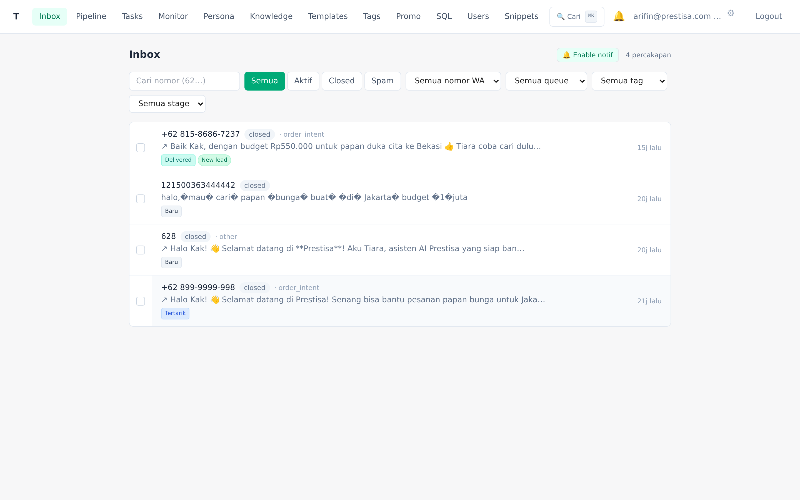

Semua chat WhatsApp di 1 layar, dengan:
- Filter by status / queue / tag / pipeline stage
- Last intent classification AI (`order_intent`, `pricing`, `complaint`, dll)
- Bulk action (assign, snooze, set stage, tag, close — semua sekaligus)
- Live update via Socket.IO (chat baru muncul tanpa refresh)
- Browser push notification

### 4.2 Sales Pipeline Kanban

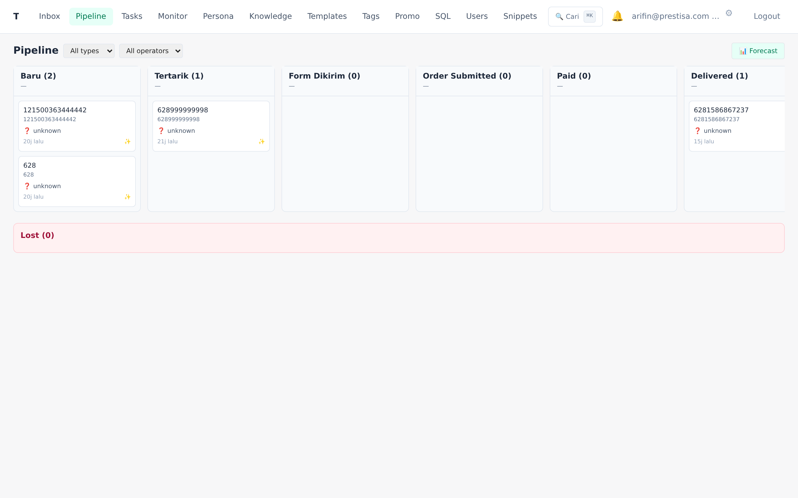

CRM klasik diadaptasi untuk e-commerce bunga:

**6 stage utama:** Baru → Tertarik → Form Dikirim → Order Submitted → Paid → Delivered + **Lost** (8 reason: no_reply, harga_terlalu_tinggi, kompetitor, produk_tidak_cocok, timing_tidak_pas, cancelled, refund_complaint, other).

Setiap stage transition **otomatis** dari event existing (intent classifier, tool firing, MySQL order state). Operator bisa drag-drop manual override.

**Forecast panel:**
- Expected revenue (Σ deal value × probability per stage)
- Realized revenue 30d
- Conversion rate antar stage (identifikasi bottleneck)
- Avg waktu per stage
- Top Lost reason

### 4.3 AI Monitor Dashboard

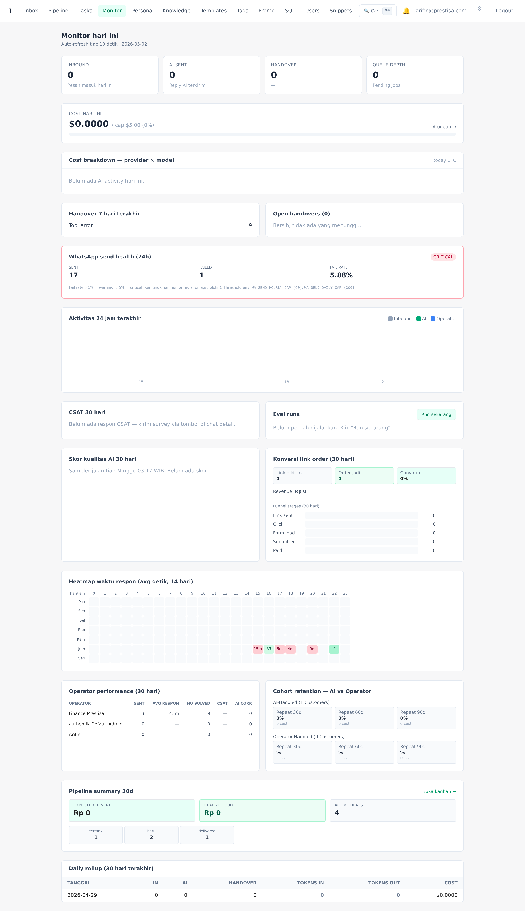

Bird-eye view untuk owner:
- KPI today (in/out/active/cost)
- 24h timeline chart (peak hour identification)
- Pipeline summary 30d
- **Operator performance** — sent count, avg respon, HO solved, CSAT, AI corrections per operator
- **Cohort retention** — AI-handled vs operator-handled customer: 30/60/90d repeat-order rate
- **Conversion funnel** — Link sent → Click → Form load → Submitted → Paid + drop-off %
- **Heatmap waktu respon** 7×24 cell warna-coded
- AI quality score (LLM-as-judge weekly)
- WA send health (deteksi nomor bermasalah)

### 4.4 AI Agent Configurable

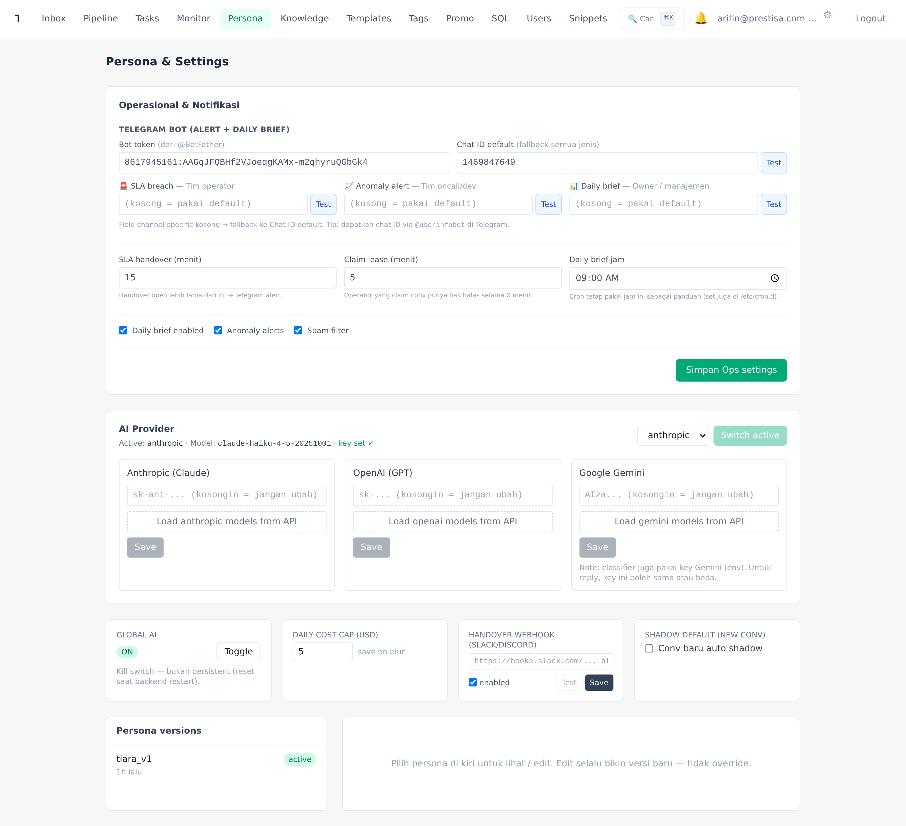

- **Multi-LLM provider** — Claude / OpenAI / Gemini, switch live tanpa restart
- **Persona editor** — edit prompt Tiara, save versi, rollback kalau bermasalah
- **Telegram multi-channel** — SLA alert ke grup operator, anomaly ke dev, daily brief ke owner
- **Cost cap** — set daily limit, AI auto-handover saat budget habis
- **Shadow mode per-conv** — AI tetap generate, operator review

### 4.5 Knowledge Base Self-Improving

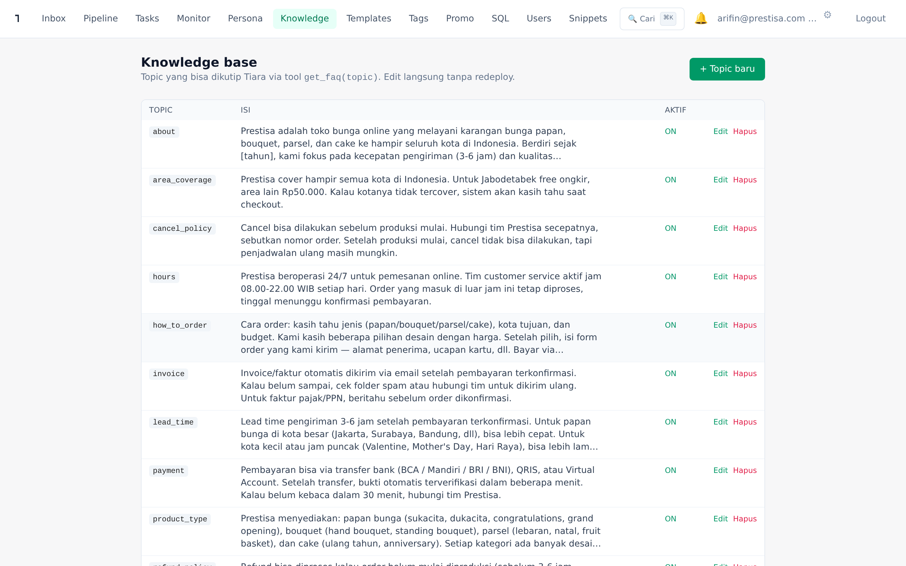

Operator edit KB topic langsung di UI, tanpa redeploy. Plus:
- **Knowledge gap auto-draft**: setiap kali AI handover karena "tidak yakin" (low_confidence), pertanyaan customer auto-captured sebagai draft KB. Operator tinggal approve + isi jawaban → langsung jadi KB topic baru.
- **Semantic search** via embeddings — AI pakai `kb_search` tool untuk query natural ("berapa lama bunga sampai?") dan retrieve topic relevan walau kata kunci beda.

### 4.6 Reply Templates + Operator Snippets

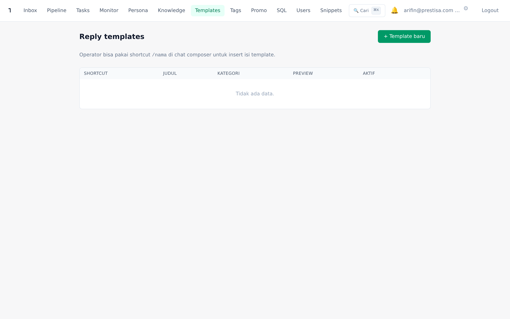 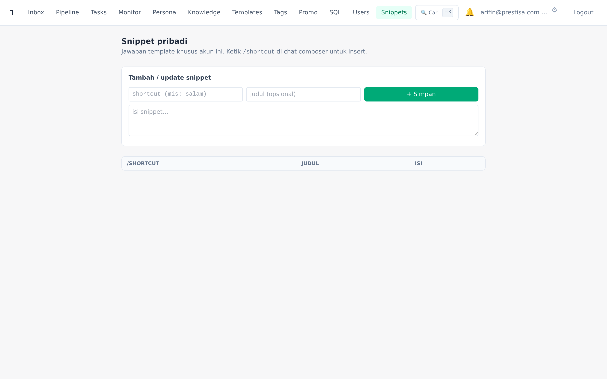

- **Templates global** — shared semua operator, untuk balasan standar tim
- **Snippets pribadi** — per-operator, untuk signature dan personal style
- Akses sama: ketik `/shortcut` di composer → autocomplete

### 4.7 Tags + Pipeline Type Mapping

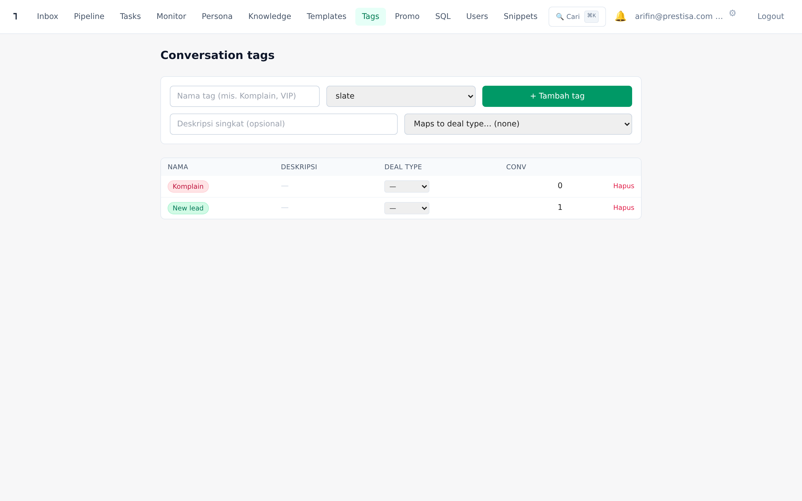

Tag tidak hanya label — bisa map ke pipeline type (mis. tag "Wedding-2026" → otomatis set deal type=wedding). Plus auto-tagging oleh AI berdasar intent classifier.

### 4.8 Promo Settings

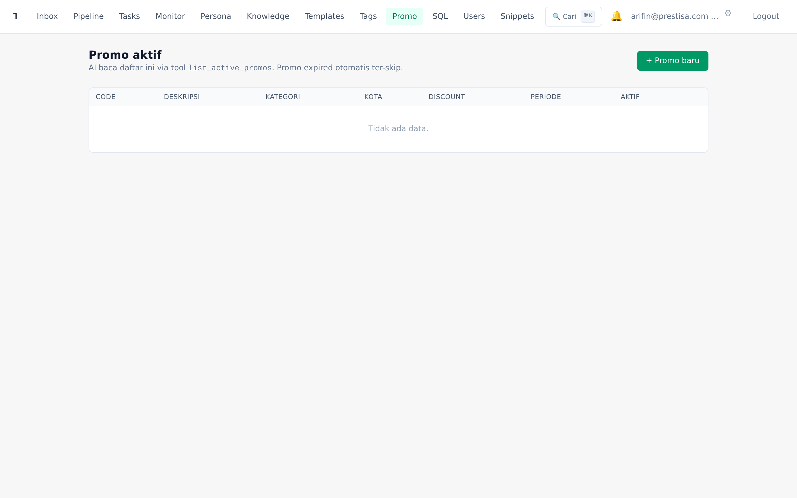

Promo aktif di-update via UI. AI cek setiap reply — kalau ada promo relevan, AI sebut otomatis. Owner control penuh tanpa redeploy.

### 4.9 User Management + Presence

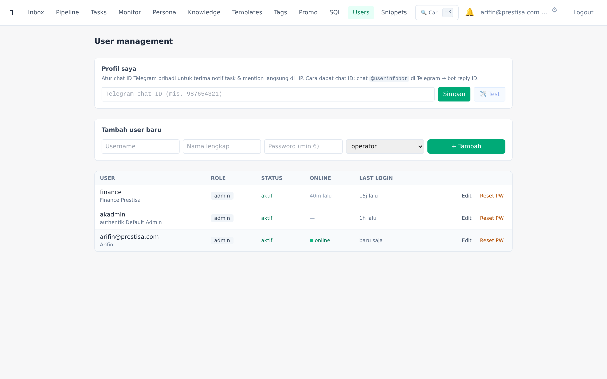

- Add/edit operator dengan role (admin/operator/viewer)
- Reset password
- **Presence**: dot hijau saat operator online (heartbeat tiap 45s)
- Last login tracking
- Profil pribadi: opt-in **Telegram chat ID** untuk terima notif task & mention langsung di HP

### 4.10 Tasks, Notifications, Internal Comments (Operator Productivity v2)

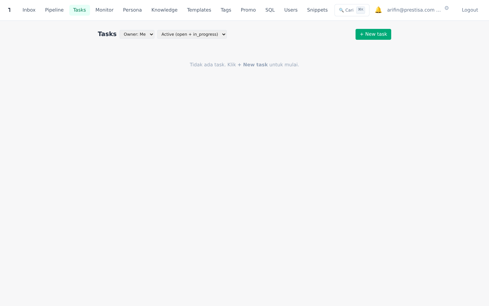

Toolkit kolaborasi tim untuk handle volume chat tinggi tanpa kehilangan follow-up commitment:

- **Tasks** — to-do per operator dengan due datetime + 4-state workflow (open/in_progress/done/cancelled). Bisa per-conv (terkait chat tertentu) atau standalone (operasional umum). Auto-reminder 1 jam sebelum due via in-app + Telegram personal.
- **Notifications bell** — badge unread di top bar, dropdown 10 notif terakhir (task assigned/due/overdue + mention). Mark read inline.
- **Internal comments + @mention** — thread privat per chat untuk koordinasi tim. Live autocomplete `@username` (Slack-style), notif otomatis ke yang di-mention. **Tidak pernah masuk WhatsApp** — operator only.
- **Telegram personal binding** — operator paste chat ID di profil → semua notif (task & mention) auto-DM ke HP. Cocok kalau operator nggak selalu buka CRM.

---

## 5. Stack & Reliability

### Yang Membuat Tiara Tahan Banting
- **Anti-ban WhatsApp** (untuk WAHA NOWEB engine):
  - Typing indicator natural
  - Random reply delay 2-9s adaptive
  - Hourly + daily send-rate caps
  - Warmup mode untuk nomor baru
  - Quiet hours (Asia/Jakarta)
  - Opt-out detection (STOP/BERHENTI)
  - Spam contact filter (block link/affiliate flood)
- **PII protection** — auto-detect & mask card/NIK/CVV di body sebelum simpan DB
- **Cost guard** — daily cap LLM, AI auto-handover saat habis
- **Backup harian** otomatis pukul 02:30 WIB ke `/var/backups/crm/` (14 hari retention)
- **Audit log** — settings change, pipeline transitions, AI corrections
- **Health checks** — daily WA send health 08:35, weekly comprehensive audit Friday 09:23
- **Anomaly detection** — alert otomatis kalau spike komplain/refund/handover/send_failed

### Tech Stack
- Backend: Node.js 20 + Express 5 + PostgreSQL + MySQL (read-only product/order data)
- Frontend: Next.js 14 + Tailwind v3 + SWR + Socket.IO
- WhatsApp: WAHA (self-hosted, with Meta Cloud API path siap untuk migrasi)
- LLM: Claude Sonnet 4.6 (reply) + Gemini 2.5 Flash (intent classifier) + OpenAI (embeddings + Whisper transcription)
- Hosting: VPS sendiri, full control data
- Reverse proxy: Caddy (auto-HTTPS)
- Process manager: PM2

### Compliance & Privacy
- Data customer **disimpan di server sendiri**, bukan cloud SaaS pihak ke-3
- LLM provider: hanya text yang diperlukan untuk reply, tidak training opt-out (sesuai T&C provider)
- Operator audit trail — semua action ter-log
- PII scrubbing built-in

---

## 6. ROI Estimasi (Toko Bunga 5,700 chat/hari)

**Asumsi baseline:**
- 350 unique customer/hari
- 5 operator manual @ Rp 5jt = Rp 25jt/bulan
- Average order value (AOV) Rp 500k
- Conversion rate baseline 10% (35 order/hari = 1,050 order/bulan)

**Setelah Tiara:**
- 2 operator + AI = Rp 12jt/bulan (gaji) + Rp 2jt (LLM cost) = **Rp 14jt/bulan**
- AI handle ~75% chat (FAQ, pricing, order URL kirim) → operator fokus closing
- Conversion rate naik ke 13-15% (lebih cepat respon, follow-up otomatis) = ~150 order extra/bulan = Rp 75jt revenue tambahan
- Repeat customer rate naik (recurring suggestion + post-delivery CSAT) = ~10% extra LTV

**Net impact bulan pertama:**
- Saving operasional: Rp 11jt
- Revenue tambahan: Rp 75jt
- **Total uplift: ~Rp 86jt/bulan**

ROI break-even <30 hari (asumsi setup cost ~Rp 30-40jt one-time + Rp 14jt/bulan running).

> **Disclaimer:** angka ini estimasi berdasar asumsi baseline. Hasil aktual bergantung pada kualitas KB, persona tuning, dan disiplin operator pakai tools.

---

## 7. Roadmap

### Sudah live (v1 + v2)
- ✅ Inbox + chat detail dengan AI suggest, perhalus, katalog picker
- ✅ Sales pipeline kanban + forecast
- ✅ AI Monitor dashboard lengkap
- ✅ Knowledge base + auto-draft dari gap detection
- ✅ Reply templates + operator snippets
- ✅ Tags dengan auto-tagging
- ✅ Multi-LLM provider switch
- ✅ Telegram multi-channel alerts (SLA / Anomaly / Daily brief)
- ✅ Customer health score (VIP/Warm/Cold/At-Risk)
- ✅ Customer facts auto-extracted
- ✅ Delivery comms (paid_confirm, H-1, H+1 CSAT)
- ✅ Anomaly detection + daily brief
- ✅ Operator presence + claim/lease
- ✅ Anti-ban hygiene + spam filter
- ✅ **Tasks & reminders** (hybrid conv-scoped/standalone, due datetime, snooze)
- ✅ **Notifications bell** dengan unread badge + auto-mark on click
- ✅ **Internal comments + @mention** dengan live autocomplete
- ✅ **Telegram personal binding** untuk notif task & mention langsung di HP

### v3 (in design — Sub-project 3 Retention)
- ⏳ Customer segmentation builder (filter customer by attribute kombinasi)
- ⏳ Lifecycle workflow engine (trigger event/time → conditions → actions)
- ⏳ Pre-built journey templates (birthday, anniversary, win-back churned, post-purchase)
- 🔮 Loyalty points / voucher system (defer — butuh integrasi order form Prestisa)

### Long-term
- 🌐 Meta Cloud API migration path (template-based broadcast)
- 📞 Voice agent integration
- 🛍 Cross-sell ke marketplace

---

## 8. Demo + Tanya Jawab

**Hubungi:** finance.parselia@gmail.com
**URL aktif:** https://salesai.prestisa.net (akun demo bisa diatur on-request)

---

*Tiara CRM dibangun untuk Prestisa, dapat di-customize untuk toko bunga / florist lain dengan workflow serupa. Source code & deployment guide tersedia.*

**Versi marketing deck**: 1.1 (2026-05-02). Update: include operator productivity suite v2.
